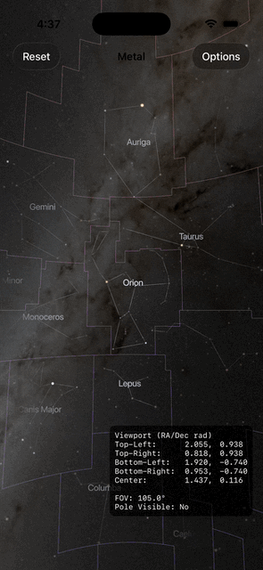

# Planetarium

Planetarium is a Metal-driven star viewer that renders a skybox, stars, and constellation data using the StarryNight data package. It is organized around a central `Renderer` that coordinates specialized sub-renderers and a gesture-driven camera.

**Major Features**
- Interactive camera with pan, zoom, and momentum; supports smooth animated pans to selected stars.
- Star selection UX with a rotating crosshair, off-screen triangle indicators, and a toolbar to show star details.
- Optional overlays for H3 grid lines, constellation borders, constellation connection lines, and constellation labels.
- Debug viewport overlay for inspecting rays, FOV, and camera state.

**Metal Renderer Architecture**
- `Renderer` owns the Metal device/queue, projection/view matrices, and the render loop; it composes all sub-renderers into a single frame.
- `SkyboxRenderer` draws the cubemap background first with a depth state that preserves the skybox at infinity.
- `H3GridRenderer` renders the geodesic grid overlay using line instances derived from H3 cells.
- `StarRenderer` renders instanced billboard quads for stars, tinted by spectral class and scaled by magnitude.
- `ConstellationLineRenderer` builds static line buffers for constellation connections and draws them as anti-aliased screen-space lines.
- `ConstellationBorderRenderer` tessellates border segments into great-circle arcs with a declination-based gradient.
- `ConstellationLabelRenderer` uses MSDF text meshes to place constellation names at their display centers.
- `CrosshairRenderer` draws a rotating crosshair around the selected star in world space.
- `TriangleIndicatorRenderer` draws screen-edge indicators for selected stars that are off-screen, with hit testing for quick navigation.
